# Alawein Platform - System Architecture

> Last verified: 2025-12-09

Comprehensive guide to the system architecture, data flow, and component
hierarchy.

---

## Table of Contents

1. System Overview
2. Architecture Diagrams
3. Data Flow
4. Component Hierarchy
5. State Management
6. Backend Architecture
7. Security Model
8. Performance
9. Directory Structure

---

## System Overview

The Alawein Platform is a React/TypeScript application featuring:

- **Frontend**: React 18 + Vite + TypeScript
- **Styling**: Tailwind CSS + Shadcn UI + Framer Motion
- **State**: Zustand (global) + TanStack Query (server)
- **Backend**: Lovable Cloud (PostgreSQL + Edge Functions)
- **Auth**: Built-in authentication with RLS

---

## Architecture Diagrams

### High-Level System Architecture

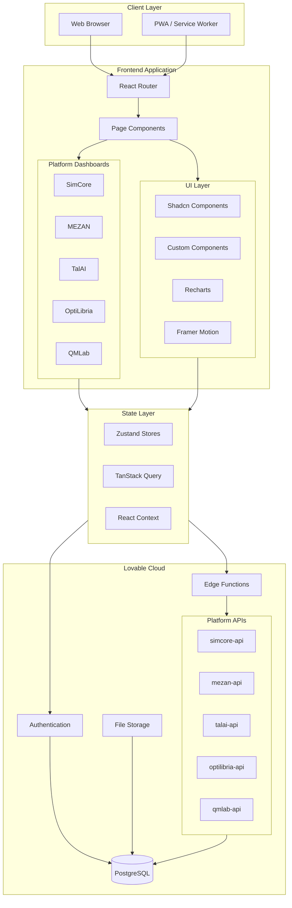

### Component Architecture

```mermaid
graph LR
    subgraph App["Application Root"]
        AppTsx[App.tsx]
        Router[BrowserRouter]
    end

    subgraph Providers["Context Providers"]
        QueryProvider[QueryClientProvider]
        ThemeProvider[ThemeProvider]
        AuthProvider[AuthProvider]
        ToastProvider[Toaster]
    end

    subgraph Routes["Route Components"]
        Landing[Landing]
        Portfolio[Portfolio]
        ProjectsHub[Projects Hub]
        Studios[Studios]
        Auth[Auth Page]
    end

    subgraph Layouts["Layout Components"]
        PageLayout[PageLayout]
        CyberpunkLayout[CyberpunkLayout]
        ProjectLayout[ProjectLayout]
    end

    AppTsx --> Router
    Router --> Providers
    Providers --> Routes
    Routes --> Layouts
```

---

## Data Flow

### Request Lifecycle

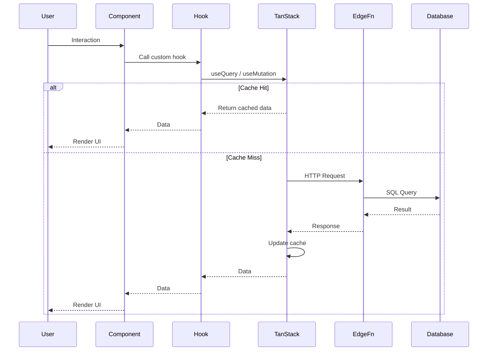

### Mutation Flow

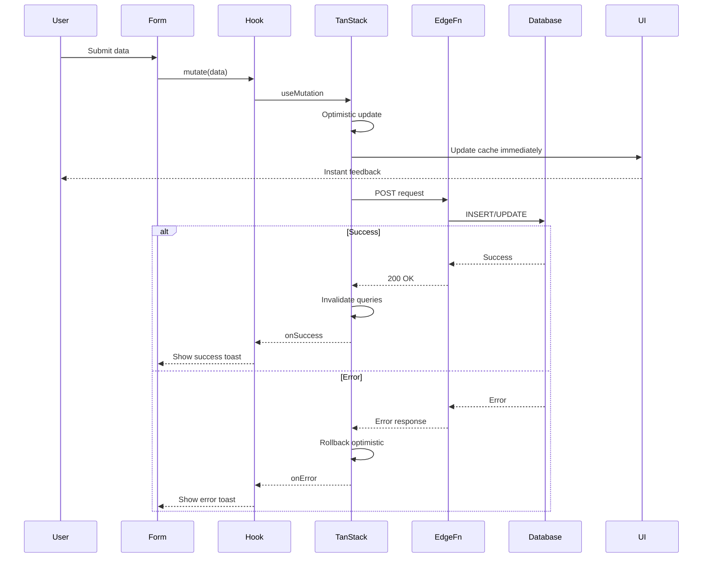

---

## Component Hierarchy

### Page Structure

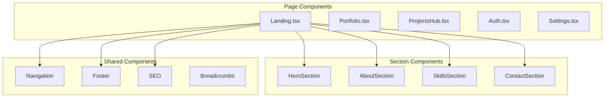

### Platform Dashboard Structure

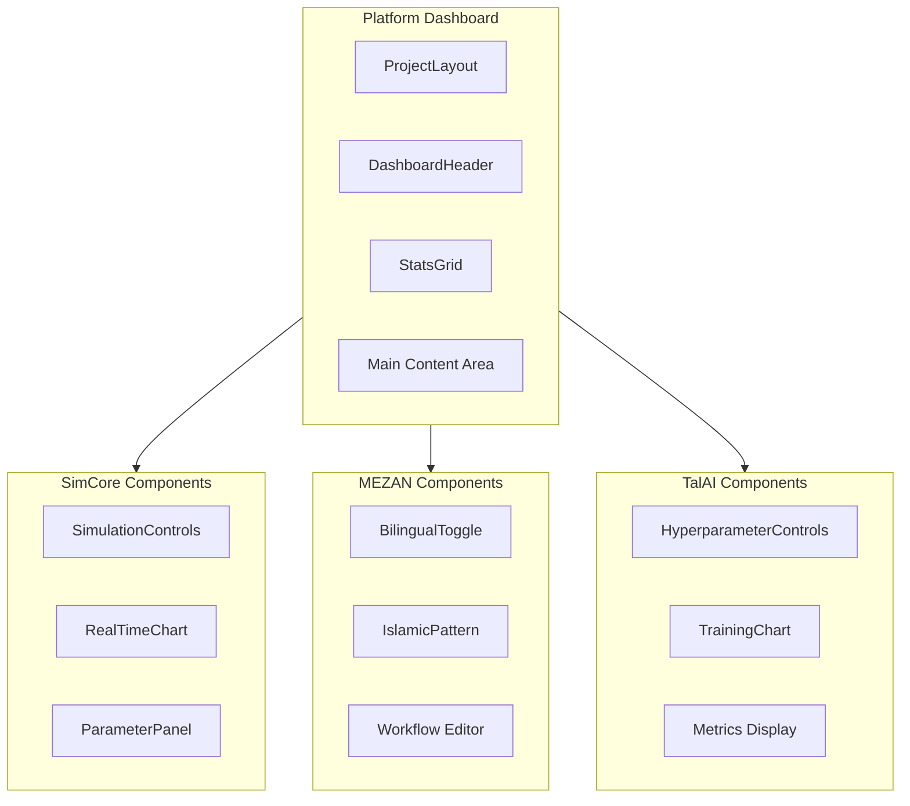

---

## State Management

### State Architecture

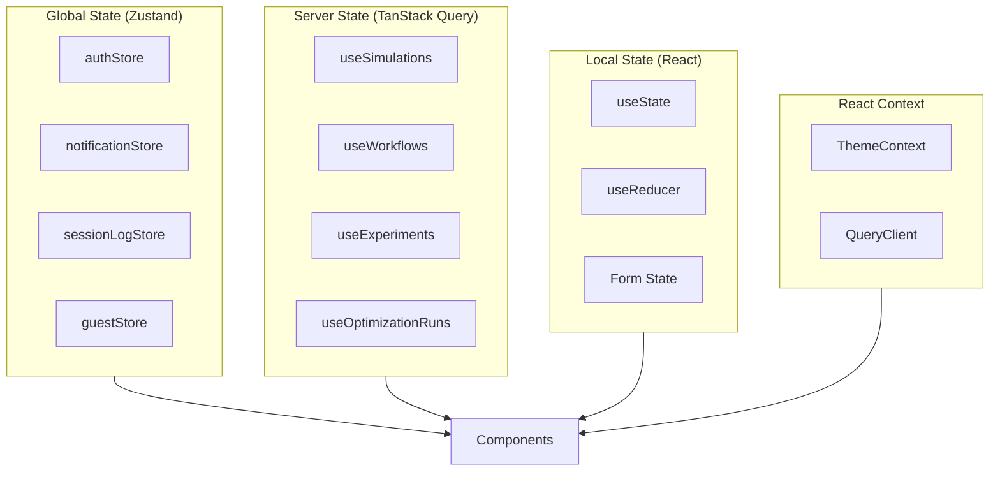

### Store Interactions

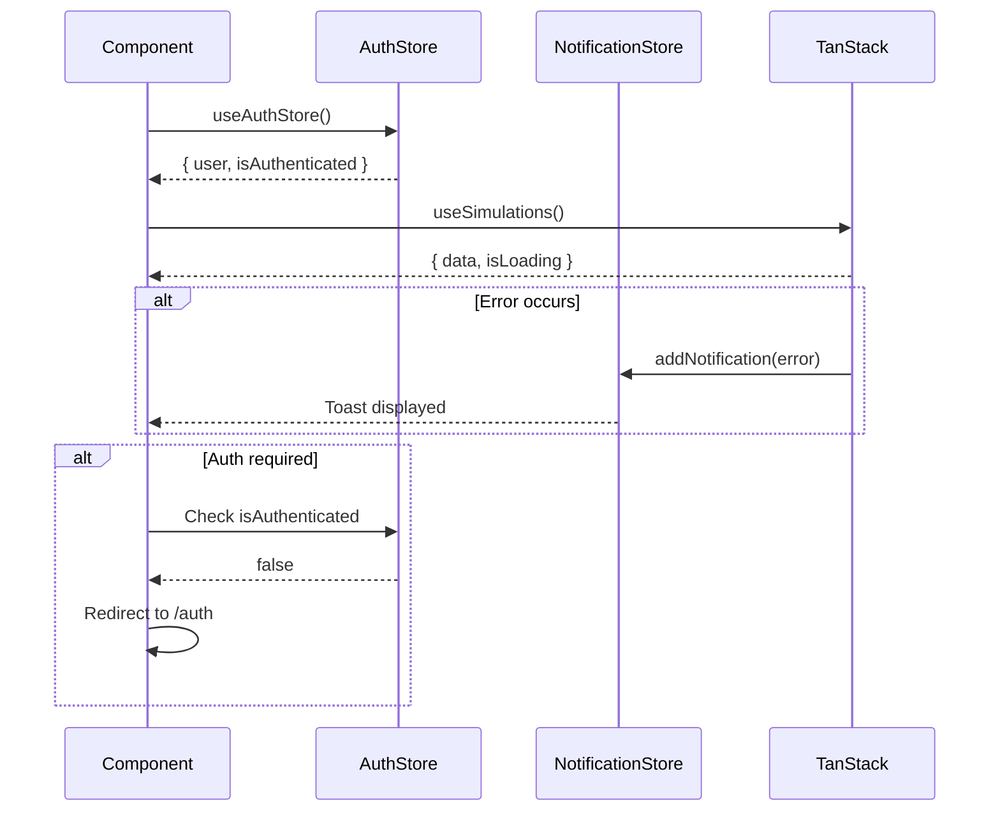

---

## Backend Architecture

### Edge Function Structure

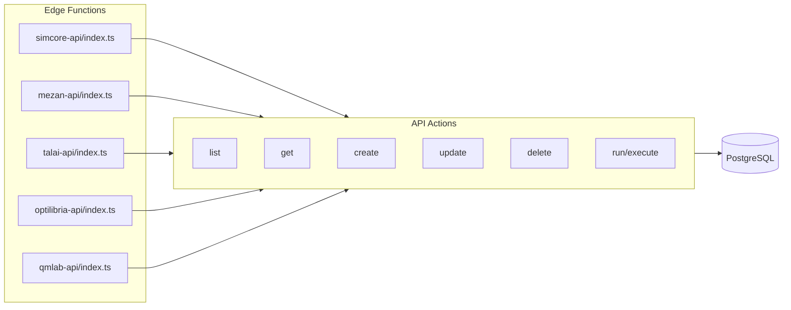

### API Request Pattern

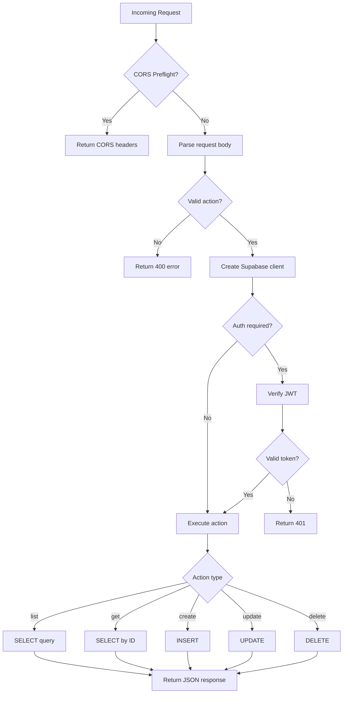

---

## Security Model

### Authentication Flow

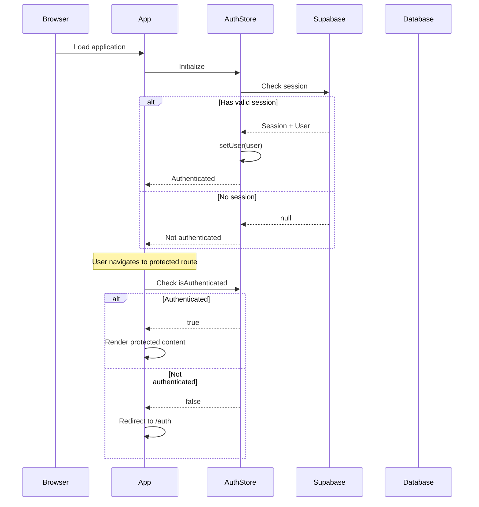

### Row Level Security

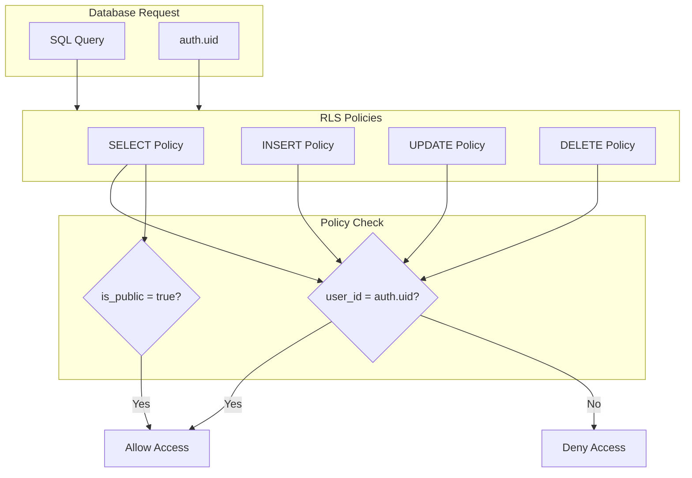

---

## Performance

### Optimization Strategies

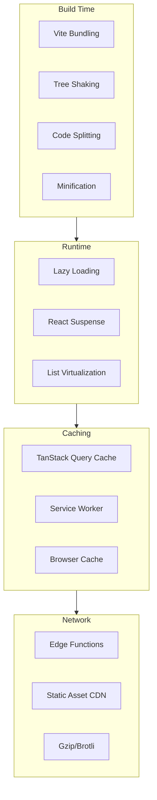

---

## Directory Structure

```
alawein-platform/
├── src/                        # Main application
│   ├── App.tsx                 # Root with router
│   ├── main.tsx                # Entry point
│   ├── index.css               # Design tokens
│   │
│   ├── pages/                  # Page components
│   │   ├── Landing.tsx
│   │   ├── Portfolio.tsx
│   │   ├── Auth.tsx
│   │   └── ...
│   │
│   ├── projects/               # Platform dashboards
│   │   ├── config.ts           # Platform registry
│   │   ├── types.ts            # Interfaces
│   │   └── pages/
│   │       ├── simcore/
│   │       ├── mezan/
│   │       ├── talai/
│   │       ├── optilibria/
│   │       └── qmlab/
│   │
│   ├── studios/                # Studios hub
│   │   ├── StudioSelector.tsx
│   │   ├── templates/
│   │   └── platforms/
│   │
│   ├── components/             # UI library
│   │   ├── ui/                 # Shadcn (40+)
│   │   └── shared/             # Shared components
│   │
│   ├── hooks/                  # Custom hooks
│   ├── stores/                 # Zustand state
│   ├── context/                # React Context
│   ├── integrations/           # External services
│   ├── types/                  # TypeScript types
│   └── utils/                  # Utilities
│
├── supabase/                   # Backend
│   ├── config.toml
│   └── functions/              # Edge functions
│
├── docs/                       # Documentation
├── tests/                      # Test suites
└── scripts/                    # Automation
```

---

## Design System

### Token-Based Approach

All styling uses semantic tokens defined in `src/index.css`:

```css
/* Core tokens */
--background: 240 40% 10%;
--foreground: 0 0% 100%;
--primary: 271 91% 65%;
--secondary: 245 45% 20%;
--accent: 330 81% 60%;
--muted: 245 30% 25%;
--border: 0 0% 100% / 0.08;
```

### Available Themes

| Theme         | Description                      |
| ------------- | -------------------------------- |
| Quantum       | Space-like purple/cyan (default) |
| Glassmorphism | Frosted glass effects            |
| Dark          | High contrast minimal            |
| Light         | Clean whites                     |

---

## Related Documentation

- [Modules](./MODULES.md) - Detailed module breakdown
- [Routing](./ROUTING.md) - Route and API documentation
- [ERD](./ERD.md) - Database schema
- [Business Flows](./BUSINESS_FLOWS.md) - User journey diagrams
- [Design System](./DESIGN_SYSTEM.md) - Styling tokens
- [UI Components](./UI_COMPONENTS.md) - Component reference
