# Business Flows

> Last verified: 2025-12-09

User journey and process diagrams for key platform operations.

---

## Table of Contents

1. Authentication Flow
2. Simulation Creation (SimCore)
3. Workflow Execution (MEZAN)
4. AI Experiment (TalAI)
5. Optimization Run (OptiLibria)
6. Quantum Experiment (QMLab)

---

## Authentication Flow

### Sequence Diagram

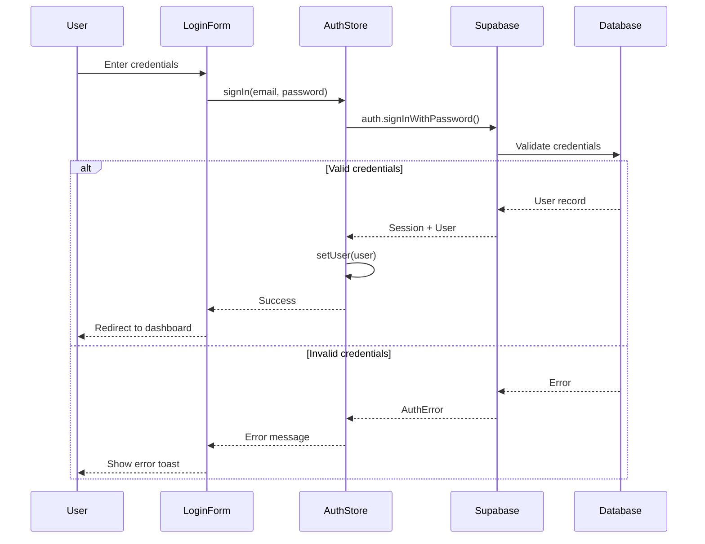

### Flowchart

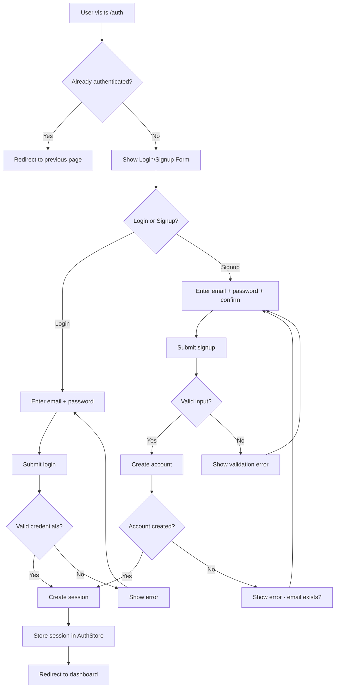

---

## Simulation Creation (SimCore)

### Sequence Diagram

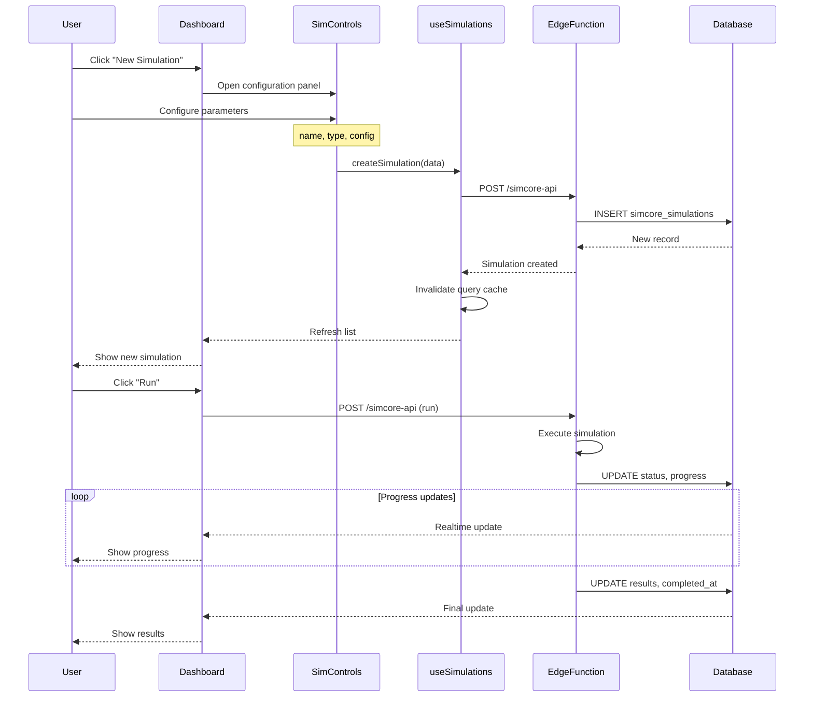

### Flowchart

```mermaid
flowchart TD
    A[User opens SimCore] --> B[Load existing simulations]
    B --> C{Has simulations?}

    C -->|No| D[Show empty state]
    C -->|Yes| E[Display simulation list]

    D --> F[Click "Create First Simulation"]
    E --> G[Click "New Simulation"]

    F --> H[Open configuration panel]
    G --> H

    H --> I[Enter simulation name]
    I --> J[Select simulation type]
    J --> K[Configure parameters]
    K --> L[Click "Create"]

    L --> M{Valid configuration?}
    M -->|No| N[Show validation error]
    N --> K

    M -->|Yes| O[Save to database]
    O --> P[Simulation created - pending]

    P --> Q{Run immediately?}
    Q -->|No| R[Return to list]
    Q -->|Yes| S[Start simulation]

    S --> T[Status: running]
    T --> U[Process simulation]
    U --> V{Completed?}

    V -->|Error| W[Status: failed]
    V -->|Success| X[Status: completed]

    W --> Y[Show error details]
    X --> Z[Display results chart]
```

---

## Workflow Execution (MEZAN)

### Sequence Diagram

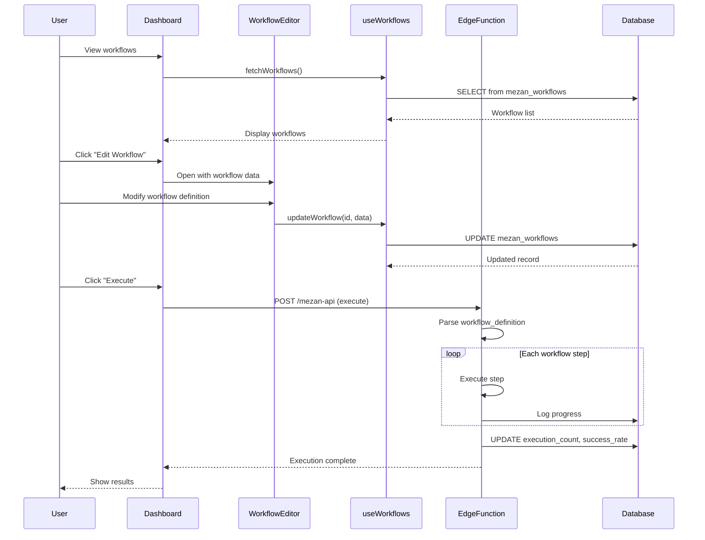

### Flowchart

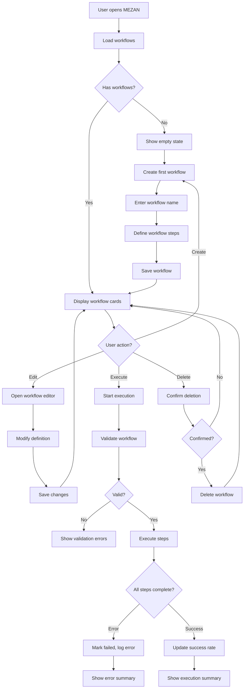

---

## AI Experiment (TalAI)

### Sequence Diagram

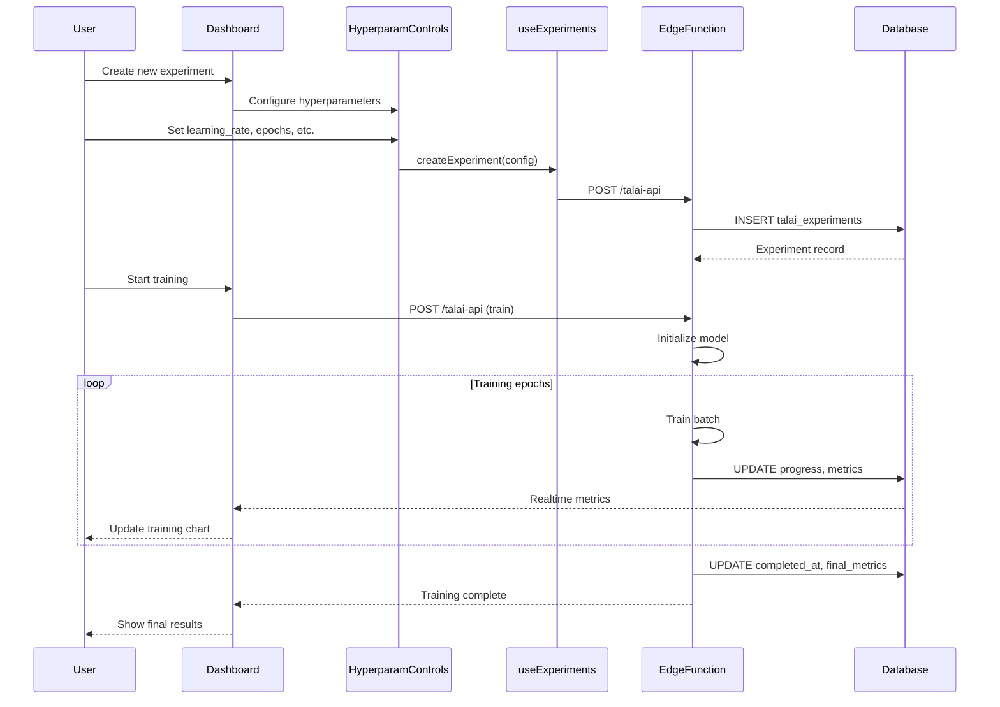

### Flowchart

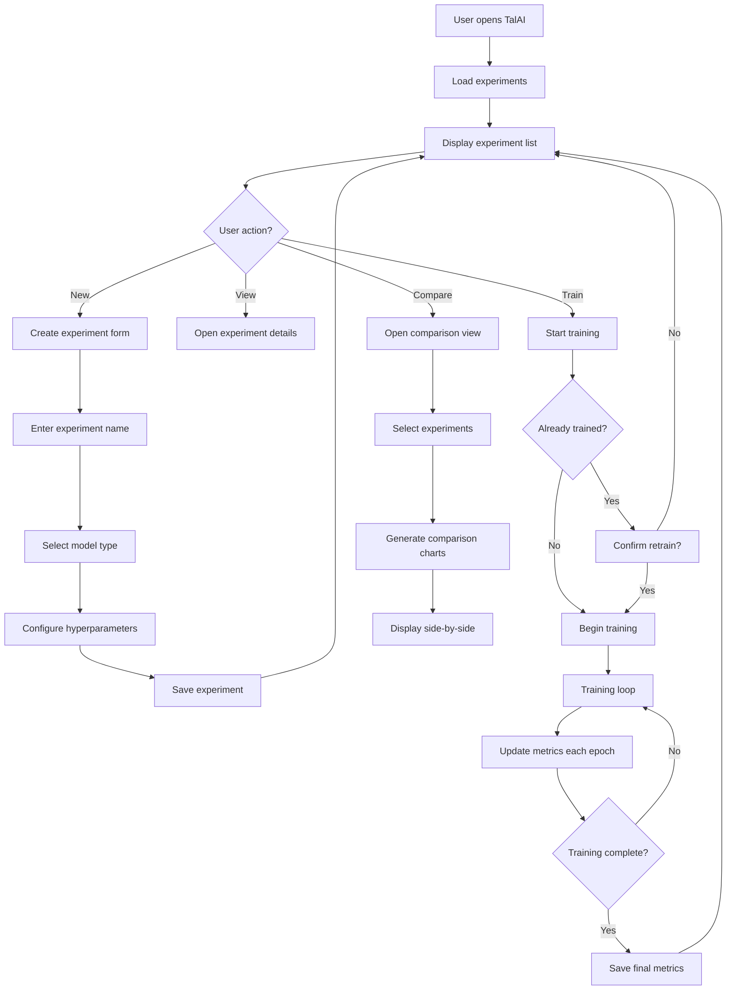

---

## Optimization Run (OptiLibria)

### Sequence Diagram

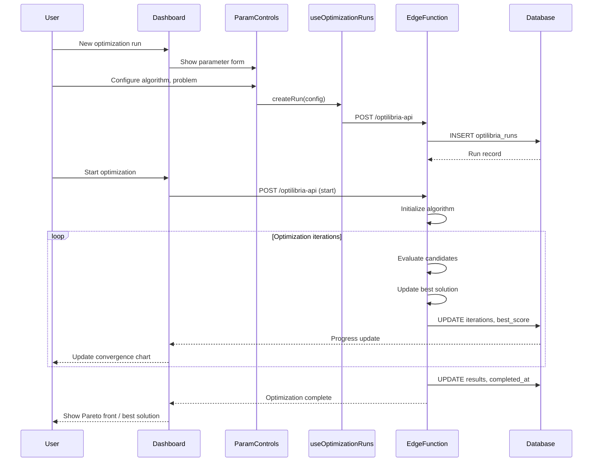

---

## Quantum Experiment (QMLab)

### Sequence Diagram

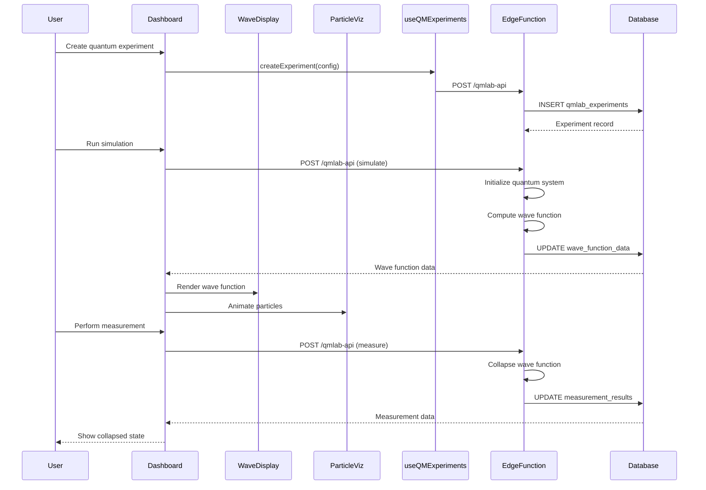

---

## Common Patterns

### Error Handling Flow

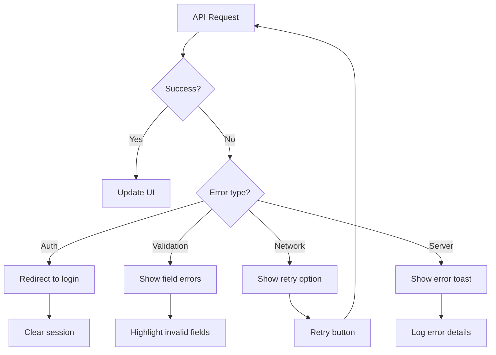

### Data Sync Pattern

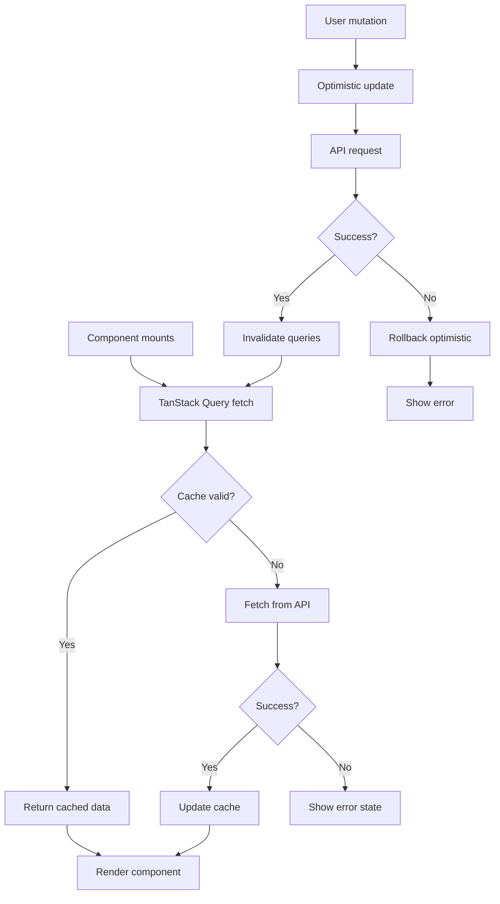

---

## Related Documentation

- [Architecture](./ARCHITECTURE.md) - System design
- [Routing](./ROUTING.md) - API endpoints
- [ERD](./ERD.md) - Database schema
- [Modules](./MODULES.md) - Code organization
