# Entity Relationship Diagram

> Last verified: 2025-12-09

Database schema documentation for the Alawein Platform.

---

## Table of Contents

1. ER Diagram
2. Core Tables
3. Platform Tables
4. Enums
5. Relationships
6. RLS Policies

---

## ER Diagram

```mermaid
erDiagram
    profiles ||--o{ simcore_simulations : "owns"
    profiles ||--o{ mezan_workflows : "owns"
    profiles ||--o{ talai_experiments : "owns"
    profiles ||--o{ optilibria_runs : "owns"
    profiles ||--o{ qmlab_experiments : "owns"
    profiles ||--o{ user_project_preferences : "has"

    projects ||--o{ project_features : "has"
    projects ||--o{ project_tech_stack : "has"
    projects ||--o{ user_project_preferences : "referenced_by"

    soc_teams ||--o{ soc_user_roles : "has"

    profiles {
        uuid id PK
        string email
        string full_name
        string avatar_url
        timestamp created_at
        timestamp updated_at
    }

    projects {
        uuid id PK
        string name
        string slug UK
        string tagline
        string description
        project_category category
        project_status status
        boolean is_public
        uuid owner_id FK
        string version
        timestamp created_at
        timestamp updated_at
    }

    project_features {
        uuid id PK
        uuid project_id FK
        string name
        string description
        boolean is_enabled
        integer order_index
        timestamp created_at
    }

    project_tech_stack {
        uuid id PK
        uuid project_id FK
        string technology
        string category
        timestamp created_at
    }

    user_project_preferences {
        uuid id PK
        uuid user_id FK
        uuid project_id FK
        string theme_variant
        boolean sidebar_collapsed
        boolean notifications_enabled
        json custom_settings
        timestamp last_visited_at
        timestamp created_at
        timestamp updated_at
    }

    simcore_simulations {
        uuid id PK
        uuid user_id FK
        string name
        string simulation_type
        string status
        integer progress
        json config
        json results
        timestamp started_at
        timestamp completed_at
        timestamp created_at
        timestamp updated_at
    }

    mezan_workflows {
        uuid id PK
        uuid user_id FK
        string name
        string description
        string status
        json workflow_definition
        integer execution_count
        float success_rate
        timestamp last_executed_at
        timestamp created_at
        timestamp updated_at
    }

    talai_experiments {
        uuid id PK
        uuid user_id FK
        string name
        string model_type
        string status
        integer progress
        json hyperparameters
        json metrics
        timestamp started_at
        timestamp completed_at
        timestamp created_at
        timestamp updated_at
    }

    optilibria_runs {
        uuid id PK
        uuid user_id FK
        string problem_name
        string algorithm
        string status
        integer iterations
        float best_score
        json config
        json results
        timestamp started_at
        timestamp completed_at
        timestamp created_at
        timestamp updated_at
    }

    qmlab_experiments {
        uuid id PK
        uuid user_id FK
        string name
        string quantum_system
        string status
        integer particle_count
        json wave_function_data
        json measurement_results
        timestamp created_at
        timestamp updated_at
    }

    soc_teams {
        uuid id PK
        string name
        string description
        timestamp created_at
        timestamp updated_at
    }

    soc_user_roles {
        uuid id PK
        uuid user_id FK
        uuid team_id FK
        soc_role role
        timestamp created_at
    }
```



---

## Core Tables

### profiles

User profile information linked to Supabase Auth.

| Column       | Type          | Nullable | Default | Description                         |
| ------------ | ------------- | -------- | ------- | ----------------------------------- |
| `id`         | `uuid`        | No       | -       | Primary key (matches auth.users.id) |
| `email`      | `text`        | Yes      | -       | User email address                  |
| `full_name`  | `text`        | Yes      | -       | Display name                        |
| `avatar_url` | `text`        | Yes      | -       | Profile picture URL                 |
| `created_at` | `timestamptz` | No       | `now()` | Creation timestamp                  |
| `updated_at` | `timestamptz` | No       | `now()` | Last update timestamp               |

### projects

Platform/project metadata.

| Column        | Type               | Nullable | Default             | Description             |
| ------------- | ------------------ | -------- | ------------------- | ----------------------- |
| `id`          | `uuid`             | No       | `gen_random_uuid()` | Primary key             |
| `name`        | `text`             | No       | -                   | Project name            |
| `slug`        | `text`             | No       | -                   | URL-friendly identifier |
| `tagline`     | `text`             | Yes      | -                   | Short description       |
| `description` | `text`             | Yes      | -                   | Full description        |
| `category`    | `project_category` | No       | -                   | Project category enum   |
| `status`      | `project_status`   | Yes      | -                   | Project status enum     |
| `is_public`   | `boolean`          | Yes      | `true`              | Public visibility       |
| `owner_id`    | `uuid`             | Yes      | -                   | Owner user ID           |
| `version`     | `text`             | Yes      | -                   | Version string          |
| `created_at`  | `timestamptz`      | No       | `now()`             | Creation timestamp      |
| `updated_at`  | `timestamptz`      | No       | `now()`             | Last update timestamp   |

### project_features

Feature flags for projects.

| Column        | Type          | Nullable | Default             | Description             |
| ------------- | ------------- | -------- | ------------------- | ----------------------- |
| `id`          | `uuid`        | No       | `gen_random_uuid()` | Primary key             |
| `project_id`  | `uuid`        | No       | -                   | Foreign key to projects |
| `name`        | `text`        | No       | -                   | Feature name            |
| `description` | `text`        | Yes      | -                   | Feature description     |
| `is_enabled`  | `boolean`     | Yes      | `true`              | Feature enabled flag    |
| `order_index` | `integer`     | Yes      | -                   | Display order           |
| `created_at`  | `timestamptz` | No       | `now()`             | Creation timestamp      |

### project_tech_stack

Technologies used in projects.

| Column       | Type          | Nullable | Default             | Description                     |
| ------------ | ------------- | -------- | ------------------- | ------------------------------- |
| `id`         | `uuid`        | No       | `gen_random_uuid()` | Primary key                     |
| `project_id` | `uuid`        | No       | -                   | Foreign key to projects         |
| `technology` | `text`        | No       | -                   | Technology name                 |
| `category`   | `text`        | No       | -                   | Category (frontend/backend/etc) |
| `created_at` | `timestamptz` | No       | `now()`             | Creation timestamp              |

### user_project_preferences

User preferences per project.

| Column                  | Type          | Nullable | Default             | Description             |
| ----------------------- | ------------- | -------- | ------------------- | ----------------------- |
| `id`                    | `uuid`        | No       | `gen_random_uuid()` | Primary key             |
| `user_id`               | `uuid`        | No       | -                   | User ID                 |
| `project_id`            | `uuid`        | No       | -                   | Foreign key to projects |
| `theme_variant`         | `text`        | Yes      | -                   | Theme preference        |
| `sidebar_collapsed`     | `boolean`     | Yes      | `false`             | Sidebar state           |
| `notifications_enabled` | `boolean`     | Yes      | `true`              | Notification preference |
| `custom_settings`       | `jsonb`       | Yes      | -                   | Additional settings     |
| `last_visited_at`       | `timestamptz` | Yes      | -                   | Last visit time         |
| `created_at`            | `timestamptz` | No       | `now()`             | Creation timestamp      |
| `updated_at`            | `timestamptz` | No       | `now()`             | Last update timestamp   |

---

## Platform Tables

### simcore_simulations

SimCore simulation runs.

| Column            | Type          | Nullable | Default             | Description              |
| ----------------- | ------------- | -------- | ------------------- | ------------------------ |
| `id`              | `uuid`        | No       | `gen_random_uuid()` | Primary key              |
| `user_id`         | `uuid`        | No       | -                   | Owner user ID            |
| `name`            | `text`        | No       | -                   | Simulation name          |
| `simulation_type` | `text`        | No       | -                   | Type of simulation       |
| `status`          | `text`        | Yes      | `'pending'`         | Current status           |
| `progress`        | `integer`     | Yes      | `0`                 | Progress percentage      |
| `config`          | `jsonb`       | Yes      | -                   | Configuration parameters |
| `results`         | `jsonb`       | Yes      | -                   | Simulation results       |
| `started_at`      | `timestamptz` | Yes      | -                   | Start time               |
| `completed_at`    | `timestamptz` | Yes      | -                   | Completion time          |
| `created_at`      | `timestamptz` | No       | `now()`             | Creation timestamp       |
| `updated_at`      | `timestamptz` | No       | `now()`             | Last update timestamp    |

### mezan_workflows

MEZAN workflow definitions.

| Column                | Type          | Nullable | Default             | Description              |
| --------------------- | ------------- | -------- | ------------------- | ------------------------ |
| `id`                  | `uuid`        | No       | `gen_random_uuid()` | Primary key              |
| `user_id`             | `uuid`        | No       | -                   | Owner user ID            |
| `name`                | `text`        | No       | -                   | Workflow name            |
| `description`         | `text`        | Yes      | -                   | Workflow description     |
| `status`              | `text`        | Yes      | `'draft'`           | Current status           |
| `workflow_definition` | `jsonb`       | No       | `'{}'`              | Workflow JSON definition |
| `execution_count`     | `integer`     | Yes      | `0`                 | Total executions         |
| `success_rate`        | `real`        | Yes      | -                   | Success percentage       |
| `last_executed_at`    | `timestamptz` | Yes      | -                   | Last execution time      |
| `created_at`          | `timestamptz` | No       | `now()`             | Creation timestamp       |
| `updated_at`          | `timestamptz` | No       | `now()`             | Last update timestamp    |

### talai_experiments

TalAI ML experiments.

| Column            | Type          | Nullable | Default             | Description              |
| ----------------- | ------------- | -------- | ------------------- | ------------------------ |
| `id`              | `uuid`        | No       | `gen_random_uuid()` | Primary key              |
| `user_id`         | `uuid`        | No       | -                   | Owner user ID            |
| `name`            | `text`        | No       | -                   | Experiment name          |
| `model_type`      | `text`        | Yes      | -                   | Model architecture       |
| `status`          | `text`        | Yes      | `'pending'`         | Current status           |
| `progress`        | `integer`     | Yes      | `0`                 | Training progress        |
| `hyperparameters` | `jsonb`       | Yes      | -                   | Training hyperparameters |
| `metrics`         | `jsonb`       | Yes      | -                   | Training metrics         |
| `started_at`      | `timestamptz` | Yes      | -                   | Start time               |
| `completed_at`    | `timestamptz` | Yes      | -                   | Completion time          |
| `created_at`      | `timestamptz` | No       | `now()`             | Creation timestamp       |
| `updated_at`      | `timestamptz` | No       | `now()`             | Last update timestamp    |

### optilibria_runs

OptiLibria optimization runs.

| Column         | Type          | Nullable | Default             | Description           |
| -------------- | ------------- | -------- | ------------------- | --------------------- |
| `id`           | `uuid`        | No       | `gen_random_uuid()` | Primary key           |
| `user_id`      | `uuid`        | No       | -                   | Owner user ID         |
| `problem_name` | `text`        | No       | -                   | Optimization problem  |
| `algorithm`    | `text`        | No       | -                   | Algorithm used        |
| `status`       | `text`        | Yes      | `'pending'`         | Current status        |
| `iterations`   | `integer`     | Yes      | -                   | Number of iterations  |
| `best_score`   | `real`        | Yes      | -                   | Best objective value  |
| `config`       | `jsonb`       | Yes      | -                   | Configuration         |
| `results`      | `jsonb`       | Yes      | -                   | Optimization results  |
| `started_at`   | `timestamptz` | Yes      | -                   | Start time            |
| `completed_at` | `timestamptz` | Yes      | -                   | Completion time       |
| `created_at`   | `timestamptz` | No       | `now()`             | Creation timestamp    |
| `updated_at`   | `timestamptz` | No       | `now()`             | Last update timestamp |

### qmlab_experiments

QMLab quantum experiments.

| Column                | Type          | Nullable | Default             | Description           |
| --------------------- | ------------- | -------- | ------------------- | --------------------- |
| `id`                  | `uuid`        | No       | `gen_random_uuid()` | Primary key           |
| `user_id`             | `uuid`        | No       | -                   | Owner user ID         |
| `name`                | `text`        | No       | -                   | Experiment name       |
| `quantum_system`      | `text`        | No       | -                   | Quantum system type   |
| `status`              | `text`        | Yes      | `'pending'`         | Current status        |
| `particle_count`      | `integer`     | Yes      | -                   | Number of particles   |
| `wave_function_data`  | `jsonb`       | Yes      | -                   | Wave function data    |
| `measurement_results` | `jsonb`       | Yes      | -                   | Measurement results   |
| `created_at`          | `timestamptz` | No       | `now()`             | Creation timestamp    |
| `updated_at`          | `timestamptz` | No       | `now()`             | Last update timestamp |

### soc_teams

Security Operations Center teams.

| Column        | Type          | Nullable | Default             | Description           |
| ------------- | ------------- | -------- | ------------------- | --------------------- |
| `id`          | `uuid`        | No       | `gen_random_uuid()` | Primary key           |
| `name`        | `text`        | No       | -                   | Team name             |
| `description` | `text`        | Yes      | -                   | Team description      |
| `created_at`  | `timestamptz` | No       | `now()`             | Creation timestamp    |
| `updated_at`  | `timestamptz` | No       | `now()`             | Last update timestamp |

### soc_user_roles

User roles within SOC teams.

| Column       | Type          | Nullable | Default             | Description              |
| ------------ | ------------- | -------- | ------------------- | ------------------------ |
| `id`         | `uuid`        | No       | `gen_random_uuid()` | Primary key              |
| `user_id`    | `uuid`        | No       | -                   | User ID                  |
| `team_id`    | `uuid`        | No       | -                   | Foreign key to soc_teams |
| `role`       | `soc_role`    | No       | `'viewer'`          | User role enum           |
| `created_at` | `timestamptz` | No       | `now()`             | Creation timestamp       |

---

## Enums

### project_category

```sql
CREATE TYPE project_category AS ENUM (
  'scientific-computing',
  'enterprise-automation',
  'ai-research',
  'optimization',
  'quantum-mechanics',
  'portfolio'
);
```

### project_status

```sql
CREATE TYPE project_status AS ENUM (
  'active',
  'development',
  'beta',
  'deprecated',
  'archived'
);
```

### soc_role

```sql
CREATE TYPE soc_role AS ENUM (
  'viewer',
  'analyst',
  'admin',
  'owner'
);
```

---

## Relationships

### Foreign Key Relationships

| Table                      | Column       | References     |
| -------------------------- | ------------ | -------------- |
| `project_features`         | `project_id` | `projects.id`  |
| `project_tech_stack`       | `project_id` | `projects.id`  |
| `user_project_preferences` | `project_id` | `projects.id`  |
| `soc_user_roles`           | `team_id`    | `soc_teams.id` |

### Implicit Relationships (user_id)

All platform tables reference `auth.users.id` through `user_id` column:

- `simcore_simulations.user_id`
- `mezan_workflows.user_id`
- `talai_experiments.user_id`
- `optilibria_runs.user_id`
- `qmlab_experiments.user_id`

---

## RLS Policies

### User-Owned Data Pattern

All platform tables use this RLS pattern:

```sql
-- Enable RLS
ALTER TABLE platform_table ENABLE ROW LEVEL SECURITY;

-- Users can view their own data
CREATE POLICY "Users can view own data"
ON platform_table FOR SELECT
USING (auth.uid() = user_id);

-- Users can insert their own data
CREATE POLICY "Users can insert own data"
ON platform_table FOR INSERT
WITH CHECK (auth.uid() = user_id);

-- Users can update their own data
CREATE POLICY "Users can update own data"
ON platform_table FOR UPDATE
USING (auth.uid() = user_id);

-- Users can delete their own data
CREATE POLICY "Users can delete own data"
ON platform_table FOR DELETE
USING (auth.uid() = user_id);
```

### Public Data Pattern

For public tables like `projects`:

```sql
-- Anyone can view public projects
CREATE POLICY "Anyone can view public projects"
ON projects FOR SELECT
USING (is_public = true);

-- Owners can manage their projects
CREATE POLICY "Owners can manage projects"
ON projects FOR ALL
USING (auth.uid() = owner_id);
```

---

## Database Functions

### get_user_team_id

Returns the team ID for a user.

```sql
CREATE FUNCTION get_user_team_id(_user_id uuid)
RETURNS uuid AS $$
  SELECT team_id FROM soc_user_roles
  WHERE user_id = _user_id
  LIMIT 1;
$$ LANGUAGE sql SECURITY DEFINER;
```

### has_soc_role

Checks if a user has a specific role.

```sql
CREATE FUNCTION has_soc_role(_role soc_role, _user_id uuid)
RETURNS boolean AS $$
  SELECT EXISTS (
    SELECT 1 FROM soc_user_roles
    WHERE user_id = _user_id AND role = _role
  );
$$ LANGUAGE sql SECURITY DEFINER;
```
