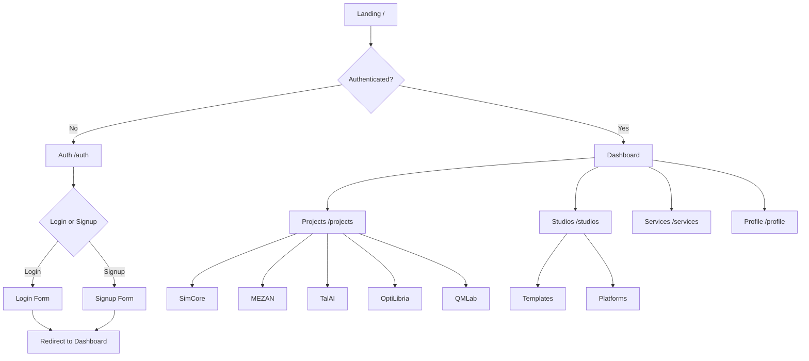

# Routing Reference

> Last verified: 2025-12-09

Complete documentation of all routes in the Alawein Platform.

---

## Table of Contents

1. Frontend Routes
2. Protected Routes
3. Edge Function Endpoints
4. Route Parameters
5. Navigation Structure

---

## Frontend Routes

### Public Routes

| Route                 | Component           | Description                  |
| --------------------- | ------------------- | ---------------------------- |
| `/`                   | `Landing`           | Main landing page            |
| `/portfolio`          | `Portfolio`         | Cyberpunk portfolio showcase |
| `/resume`             | `Resume`            | Static resume page           |
| `/interactive-resume` | `InteractiveResume` | Animated interactive resume  |
| `/pricing`            | `Pricing`           | Pricing plans page           |
| `/install`            | `Install`           | PWA installation guide       |
| `/auth`               | `Auth`              | Login/Signup page            |

### Studio Routes

| Route                | Component        | Description      |
| -------------------- | ---------------- | ---------------- |
| `/studios`           | `StudioSelector` | Main studios hub |
| `/studios/templates` | `TemplatesHub`   | Template browser |
| `/studios/platforms` | `PlatformsHub`   | Platform browser |

### Project Routes

| Route                  | Component             | Description                    |
| ---------------------- | --------------------- | ------------------------------ |
| `/projects`            | `ProjectsHub`         | All platforms overview         |
| `/projects/simcore`    | `SimCoreDashboard`    | Scientific computing dashboard |
| `/projects/mezan`      | `MEZANDashboard`      | Workflow automation dashboard  |
| `/projects/talai`      | `TalAIDashboard`      | AI research dashboard          |
| `/projects/optilibria` | `OptiLibriaDashboard` | Optimization dashboard         |
| `/projects/qmlab`      | `QMLabDashboard`      | Quantum mechanics dashboard    |
| `/project/:slug`       | `ProjectDetail`       | Dynamic project detail page    |

### Service Routes

| Route                            | Component             | Description                 |
| -------------------------------- | --------------------- | --------------------------- |
| `/services`                      | `ServicesHub`         | Services overview           |
| `/services/accessibility-audit`  | `AccessibilityAudit`  | A11y audit service          |
| `/services/design-system-review` | `DesignSystemReview`  | Design review service       |
| `/services/heuristic-evaluation` | `HeuristicEvaluation` | UX evaluation service       |
| `/services/performance-testing`  | `PerformanceTesting`  | Performance testing service |
| `/services/security-assessment`  | `SecurityAssessment`  | Security audit service      |
| `/services/user-flow-analysis`   | `UserFlowAnalysis`    | User flow analysis service  |

### Documentation Routes

| Route                | Component          | Description             |
| -------------------- | ------------------ | ----------------------- |
| `/design-system`     | `DesignSystem`     | Design token reference  |
| `/components`        | `ComponentDocs`    | Component documentation |
| `/icon-assets`       | `IconAssets`       | Icon library reference  |
| `/sticker-pack`      | `StickerPack`      | Brand stickers          |
| `/brand-consistency` | `BrandConsistency` | Brand guidelines        |
| `/book`              | `Book`             | Documentation book      |
| `/platform-preview`  | `PlatformPreview`  | Platform preview page   |

### Error Routes

| Route | Component  | Description    |
| ----- | ---------- | -------------- |
| `*`   | `NotFound` | 404 error page |

---

## Protected Routes

Routes requiring authentication are wrapped with `ProtectedRoute`:

| Route                  | Component             | Auth Required |
| ---------------------- | --------------------- | ------------- |
| `/profile`             | `Profile`             | ✅ Yes        |
| `/settings`            | `Settings`            | ✅ Yes        |
| `/projects/simcore`    | `SimCoreDashboard`    | ✅ Yes        |
| `/projects/mezan`      | `MEZANDashboard`      | ✅ Yes        |
| `/projects/talai`      | `TalAIDashboard`      | ✅ Yes        |
| `/projects/optilibria` | `OptiLibriaDashboard` | ✅ Yes        |
| `/projects/qmlab`      | `QMLabDashboard`      | ✅ Yes        |

### Protected Route Implementation

```typescript
import { ProtectedRoute } from '@/components/shared';

<Route
  path="/profile"
  element={
    <ProtectedRoute>
      <Profile />
    </ProtectedRoute>
  }
/>
```

---

## Edge Function Endpoints

### SimCore API

**Base Path:** `/functions/v1/simcore-api`

| Method | Action   | Description           | Auth     |
| ------ | -------- | --------------------- | -------- |
| GET    | `list`   | List all simulations  | Required |
| GET    | `get`    | Get simulation by ID  | Required |
| POST   | `create` | Create new simulation | Required |
| PUT    | `update` | Update simulation     | Required |
| DELETE | `delete` | Delete simulation     | Required |
| POST   | `run`    | Run simulation        | Required |

**Request Format:**

```typescript
// Query parameters
?action=list
?action=get&id=<simulation_id>

// POST body
{
  "action": "create",
  "data": {
    "name": "Simulation Name",
    "simulation_type": "fluid-dynamics",
    "config": { ... }
  }
}
```

### MEZAN API

**Base Path:** `/functions/v1/mezan-api`

| Method | Action    | Description         | Auth     |
| ------ | --------- | ------------------- | -------- |
| GET    | `list`    | List all workflows  | Required |
| GET    | `get`     | Get workflow by ID  | Required |
| POST   | `create`  | Create new workflow | Required |
| PUT    | `update`  | Update workflow     | Required |
| DELETE | `delete`  | Delete workflow     | Required |
| POST   | `execute` | Execute workflow    | Required |

### TalAI API

**Base Path:** `/functions/v1/talai-api`

| Method | Action   | Description           | Auth     |
| ------ | -------- | --------------------- | -------- |
| GET    | `list`   | List all experiments  | Required |
| GET    | `get`    | Get experiment by ID  | Required |
| POST   | `create` | Create new experiment | Required |
| PUT    | `update` | Update experiment     | Required |
| DELETE | `delete` | Delete experiment     | Required |
| POST   | `train`  | Start training        | Required |

### OptiLibria API

**Base Path:** `/functions/v1/optilibria-api`

| Method | Action     | Description                | Auth     |
| ------ | ---------- | -------------------------- | -------- |
| GET    | `list`     | List all optimization runs | Required |
| GET    | `get`      | Get run by ID              | Required |
| POST   | `create`   | Create new run             | Required |
| PUT    | `update`   | Update run                 | Required |
| DELETE | `delete`   | Delete run                 | Required |
| POST   | `optimize` | Start optimization         | Required |

### QMLab API

**Base Path:** `/functions/v1/qmlab-api`

| Method | Action    | Description           | Auth     |
| ------ | --------- | --------------------- | -------- |
| GET    | `list`    | List all experiments  | Required |
| GET    | `get`     | Get experiment by ID  | Required |
| POST   | `create`  | Create new experiment | Required |
| PUT    | `update`  | Update experiment     | Required |
| DELETE | `delete`  | Delete experiment     | Required |
| POST   | `measure` | Perform measurement   | Required |

---

## Route Parameters

### Dynamic Route Parameters

| Route Pattern         | Parameter  | Description        |
| --------------------- | ---------- | ------------------ |
| `/project/:slug`      | `slug`     | Project identifier |
| `/projects/:platform` | `platform` | Platform name      |

### Query Parameters

| Route                | Parameter  | Description            |
| -------------------- | ---------- | ---------------------- |
| `/auth`              | `mode`     | `login` or `signup`    |
| `/auth`              | `redirect` | Post-auth redirect URL |
| `/projects`          | `filter`   | Filter by status       |
| `/studios/templates` | `category` | Template category      |

---

## Navigation Structure

### Main Navigation

```
┌─────────────────────────────────────────────────────────────┐
│  Logo    Home   Projects   Studios   Services   Portfolio   │
│                                                    [Auth]   │
└─────────────────────────────────────────────────────────────┘
```

### Navigation Links

```typescript
const mainLinks = [
  { href: '/', label: 'Home' },
  { href: '/projects', label: 'Projects' },
  { href: '/studios', label: 'Studios' },
  { href: '/services', label: 'Services' },
  { href: '/portfolio', label: 'Portfolio' },
];
```

### Mobile Navigation

Mobile navigation uses a sheet/drawer pattern:

```
┌─────────────────────┐
│  ☰  Logo            │
├─────────────────────┤
│  Home               │
│  Projects           │
│  Studios            │
│  Services           │
│  Portfolio          │
│  ─────────────────  │
│  Login / Sign Up    │
└─────────────────────┘
```

---

## Route Preloading

The `PreloadLink` component handles route preloading:

```typescript
const preloadMap: Record<string, () => void> = {
  '/projects': () => import('@/projects/pages/ProjectsHub'),
  '/studios': () => import('@/studios/StudioSelector'),
  '/services': () => import('@/pages/services/ServicesHub'),
  // ...
};
```

---

## Route Flow Diagram



---

## Adding New Routes

### 1. Create Page Component

```typescript
// src/pages/NewPage.tsx
const NewPage = () => {
  return (
    <PageLayout>
      <h1>New Page</h1>
    </PageLayout>
  );
};

export default NewPage;
```

### 2. Add Route to App.tsx

```typescript
// src/App.tsx
import NewPage from '@/pages/NewPage';

<Route path="/new-page" element={<NewPage />} />
```

### 3. Add to Navigation (if needed)

```typescript
// src/components/shared/PublicHeader.tsx
const allLinks = [
  // ... existing links
  { href: '/new-page', label: 'New Page' },
];
```

### 4. Add Preloading (optional)

```typescript
// src/components/shared/PreloadLink.tsx
const preloadMap = {
  // ... existing
  '/new-page': () => import('@/pages/NewPage'),
};
```
