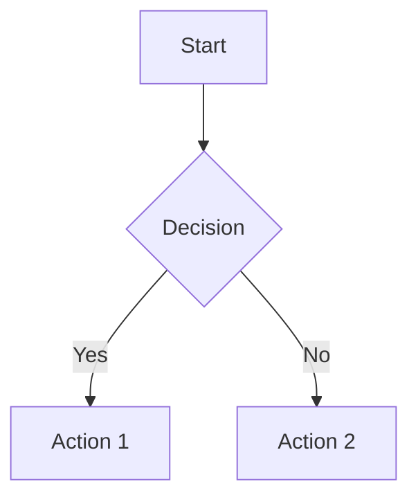

# Documentation Style Guide

> Last verified: 2025-12-09

Standards for writing and maintaining documentation in the Alawein Platform.

---

## Table of Contents

1. Terminology
2. Formatting Standards
3. Code Example Conventions
4. File Structure
5. Markdown Best Practices

---

## Terminology

### Platform Names

| Correct    | Incorrect                 |
| ---------- | ------------------------- |
| SimCore    | Simcore, simcore, SIMCORE |
| MEZAN      | Mezan, mezan              |
| TalAI      | Talai, talai, TALAI       |
| OptiLibria | Optilibria, optilibria    |
| QMLab      | Qmlab, qmlab, QMLAB       |

### Technology Terms

| Correct        | Incorrect                      |
| -------------- | ------------------------------ |
| TypeScript     | Typescript, typescript         |
| JavaScript     | Javascript, javascript         |
| React          | react, REACT                   |
| Tailwind CSS   | TailwindCSS, tailwind          |
| Supabase       | supabase, SUPABASE             |
| Zustand        | zustand                        |
| TanStack Query | React Query, tanstack query    |
| Lovable Cloud  | Supabase (in user-facing docs) |

### Project Terms

| Term          | Definition                                        |
| ------------- | ------------------------------------------------- |
| Platform      | One of the five dashboards (SimCore, MEZAN, etc.) |
| Project       | A user-created entity within a platform           |
| Edge Function | Serverless backend function                       |
| RLS           | Row-Level Security                                |
| Design Token  | CSS variable for theming                          |

### Avoid These Terms

| Avoid                        | Use Instead             |
| ---------------------------- | ----------------------- |
| Supabase dashboard           | Lovable Cloud / backend |
| Database                     | backend storage         |
| Edge Functions (user-facing) | backend functions       |
| supabase.co URLs             | (omit or abstract)      |

---

## Formatting Standards

### Headings

- Use sentence case for headings: "Getting started" not "Getting Started"
- Exception: Product names stay capitalized: "Using SimCore"
- Use H1 (`#`) only for the document title
- Use H2 (`##`) for major sections
- Use H3 (`###`) for subsections
- Don't skip heading levels (H2 → H4)

### Lists

- Use `-` for unordered lists (not `*`)
- Use `1.` for ordered lists
- Capitalize the first word of each item
- No period at the end unless it's a complete sentence

### Tables

```markdown
| Column 1 | Column 2 | Column 3 |
| -------- | -------- | -------- |
| Data 1   | Data 2   | Data 3   |
```

- Align columns using consistent spacing
- Use sentence case for headers
- Keep cells concise

### Links

```markdown
# Internal links (relative)

[ARCHITECTURE.md](./ARCHITECTURE.md) [Quick Start](../docs/QUICK_START.md)

# External links

[React Documentation](https://react.dev/)
```

- Use descriptive link text, not "click here"
- Prefer relative paths for internal links
- Verify all links work before committing

### Emphasis

- Use `**bold**` for important terms and UI elements
- Use `*italic*` for emphasis and introducing new terms
- Use `` `backticks` `` for:
  - Code snippets
  - File names and paths
  - Command-line commands
  - Variable/function names

---

## Code Example Conventions

### Language Tags

Always specify the language for syntax highlighting:

````markdown
```typescript
const example = 'typed';
```

```tsx
const Component = () => <div>JSX</div>;
```

```bash
npm install package-name
```

```sql
SELECT * FROM table_name;
```

```css
.class-name {
  color: red;
}
```
````

### TypeScript/React Examples

```typescript
// ✅ Include imports for standalone examples
import { useState } from 'react';
import { Button } from '@/components/ui/button';

// ✅ Use meaningful variable names
const userProfile = { name: 'John', email: 'john@example.com' };

// ✅ Include type annotations
interface UserProps {
  name: string;
  onSave: (data: User) => void;
}

// ❌ Don't use vague names
const x = { n: 'J', e: 'j@e.com' };
```

### Do/Don't Examples

```typescript
// ✅ Correct - Use semantic tokens
<div className="bg-background text-foreground">

// ❌ Wrong - Don't use raw colors
<div className="bg-purple-500 text-white">
```

### Command Examples

```bash
# Install dependencies
npm install

# Run development server
npm run dev

# Build for production
npm run build
```

- Add comments to explain what each command does
- Use `#` for bash comments
- Show expected output when helpful

### Import Paths

Always use path aliases:

```typescript
// ✅ Correct
import { Button } from '@/components/ui/button';
import { useAuthStore } from '@/stores/authStore';

// ❌ Wrong
import { Button } from '../../../components/ui/button';
```

---

## File Structure

### Document Header

Every document should start with:

```markdown
# Document Title

> Last verified: YYYY-MM-DD

Brief description of what this document covers.

---
```

### Table of Contents

For documents with 4+ sections:

```markdown
## Table of Contents

1. Section One
2. Section Two
3. Section Three
```

### Section Separators

Use horizontal rules between major sections:

```markdown
## Section One

Content here...

---

## Section Two

Content here...
```

### Document Footer

Optional: Add related links at the end:

```markdown
---

## Related Documentation

- [ARCHITECTURE.md](./ARCHITECTURE.md) - System architecture
- [DEVELOPMENT.md](./DEVELOPMENT.md) - Development guide
```

---

## Markdown Best Practices

### Line Length

- Keep lines under 120 characters when practical
- Break long lines at natural points (after punctuation)

### Blank Lines

- One blank line before and after headings
- One blank line before and after code blocks
- One blank line between list items (for complex items only)

### Mermaid Diagrams

Use mermaid for architecture and flow diagrams:

````markdown

````

### Callouts

Use blockquotes for notes and warnings:

```markdown
> **Note**: Important information here.

> **Warning**: Critical warning here.

> **Tip**: Helpful suggestion here.
```

### File References

When referencing files:

```markdown
See `src/components/ui/button.tsx` for the implementation.

The configuration is in [`tailwind.config.ts`](../tailwind.config.ts).
```

---

## Checklist for New Documentation

Before submitting documentation:

- [ ] Title uses H1 with document name
- [ ] Freshness date added: `> Last verified: YYYY-MM-DD`
- [ ] Table of contents included (if 4+ sections)
- [ ] All code examples have language tags
- [ ] All links verified working
- [ ] Platform names use correct capitalization
- [ ] No raw colors in code examples (use tokens)
- [ ] Import paths use `@/` alias
- [ ] No references to Supabase dashboard (use Lovable Cloud)
- [ ] Spell-checked
- [ ] Run `node scripts/validate-docs.js` locally
