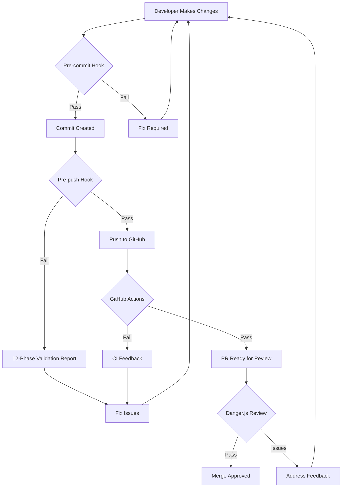

# 🚀 Comprehensive Validation System Documentation

> **Last Updated:** December 10, 2025 **Version:** 1.0.0 **Status:** Production
> Ready

## Table of Contents

1. Overview
2. Quick Start
3. Validation Phases
4. Scripts Reference
5. Configuration
6. Git Hooks
7. CI/CD Integration
8. Troubleshooting
9. Best Practices
10. FAQ

---

## Overview

The Alawein Platform implements a comprehensive 12-phase validation system that
ensures code quality, security, performance, and maintainability before any code
is pushed to GitHub.

### Key Features

- ✅ **Automated Security Scanning** - Detects vulnerabilities and exposed
  secrets
- ✅ **Design System Enforcement** - Prevents hardcoded colors, enforces
  semantic tokens
- ✅ **Code Quality Gates** - ESLint, TypeScript strict mode, Prettier
  formatting
- ✅ **Performance Optimization** - Bundle size checks, asset optimization
- ✅ **SEO & Accessibility** - WCAG 2.1 AA compliance, meta tag validation
- ✅ **Comprehensive Testing** - Unit tests, coverage requirements
- ✅ **Documentation Sync** - Ensures docs stay updated with code
- ✅ **Git Hygiene** - Conventional commits, file size limits

### Architecture

```
┌─────────────────────────────────────────────┐
│            Developer Workflow                │
└────────────┬───────────────────────────────┘
             │
             ▼
┌─────────────────────────────────────────────┐
│         Pre-commit Hook (Husky)              │
│  • Format check                              │
│  • Lint check                                 │
│  • Type check                                 │
└────────────┬───────────────────────────────┘
             │
             ▼
┌─────────────────────────────────────────────┐
│          Pre-push Hook (Husky)               │
│  • Full 12-phase validation                  │
│  • Security, quality, performance            │
│  • Build verification                        │
└────────────┬───────────────────────────────┘
             │
             ▼
┌─────────────────────────────────────────────┐
│         GitHub Actions (CI/CD)               │
│  • PR checks                                 │
│  • Danger.js automation                      │
│  • Deploy validation                         │
└─────────────────────────────────────────────┘
```

---

## Quick Start

### 1. Run Quick Validation

```bash
# Quick validation (lint + type check)
npm run validate:quick
```

### 2. Run Full Validation

```bash
# Complete 12-phase validation
npm run validate
```

### 3. Auto-fix Issues

```bash
# Fix formatting and linting issues
npm run fix

# Fix everything including security
npm run fix:all
```

### 4. Check Specific Areas

```bash
# Check for hardcoded colors
npm run check:hardcoded-colors

# Check for console statements
npm run check:console

# Check for exposed secrets
npm run check:secrets

# Run security audit
npm run check:security
```

---

## Validation Phases

### Phase 1: Security Validation 🔒

**Checks:**

- npm vulnerability audit (moderate+)
- Exposed secrets/API keys scan
- .env file security
- SQL injection patterns
- XSS vulnerabilities

**Commands:**

```bash
npm run validate:security
npm audit --audit-level=moderate
```

### Phase 2: Code Consistency & Quality ✨

**Checks:**

- Console statement removal
- TODO/FIXME comment limits
- ESLint rule compliance
- Prettier formatting
- Import structure

**Commands:**

```bash
npm run check:lint
npm run check:format
npm run check:imports
```

### Phase 3: Design System Compliance 🎨

**Checks:**

- Semantic token usage
- Forbidden hardcoded colors
- Theme consistency
- Responsive breakpoints

**Forbidden Patterns:**

```
❌ bg-slate-900, text-blue-500, border-gray-700
✅ bg-background, text-primary, border-border
```

**Commands:**

```bash
npm run validate:design
npm run check:hardcoded-colors
```

### Phase 4: TypeScript Validation 📘

**Strict Mode Settings:**

```json
{
  "noImplicitAny": true,
  "strictNullChecks": true,
  "noUnusedParameters": true,
  "noUnusedLocals": true
}
```

**Commands:**

```bash
npm run type-check
npx tsc --noEmit
```

### Phase 5: Testing Validation 🧪

**Requirements:**

- All tests must pass
- Coverage minimum: 80%
- New features need tests

**Commands:**

```bash
npm test
npm run test:coverage
```

### Phase 6: Performance Checks ⚡

**Checks:**

- Bundle size < 500KB
- Asset optimization
- Import optimization
- Memory leak detection

**Commands:**

```bash
npm run build
# Check dist/ folder size
```

### Phase 7: SEO & Accessibility 🔍

**SEO Requirements:**

- robots.txt configured
- sitemap.xml updated
- Meta tags unique per page
- Open Graph tags

**Accessibility (WCAG 2.1 AA):**

- Alt text on images
- ARIA labels
- Keyboard navigation
- Color contrast 4.5:1

### Phase 8: Dependency Validation 📦

**Checks:**

- Outdated packages
- Security vulnerabilities
- License compatibility
- Unused dependencies

**Commands:**

```bash
npm outdated
npm audit
```

### Phase 9: Build Validation 🏗️

**Requirements:**

- Production build succeeds
- No build warnings
- Output structure valid

**Commands:**

```bash
npm run build
npm run preview
```

### Phase 10: Git Hygiene 🌿

**Checks:**

- File size < 5MB
- Conventional commits
- No direct commits to main
- .gitignore compliance

**Commit Format:**

```
feat|fix|docs|style|refactor|test|chore: description
```

### Phase 11: Documentation Check 📚

**Requirements:**

- README.md > 50 lines
- API changes documented
- CHANGELOG updated

### Phase 12: Final Summary ✅

Aggregates all results and provides pass/fail decision.

---

## Scripts Reference

### Core Validation Scripts

| Script                      | Description              | When to Use              |
| --------------------------- | ------------------------ | ------------------------ |
| `npm run validate`          | Full 12-phase validation | Before pushing           |
| `npm run validate:quick`    | Lint + type check only   | During development       |
| `npm run validate:full`     | Same as validate         | Before releases          |
| `npm run validate:design`   | Design system checks     | After UI changes         |
| `npm run validate:security` | Security scanning        | After dependency updates |

### Check Scripts

| Script                           | Description             | Exit Code            |
| -------------------------------- | ----------------------- | -------------------- |
| `npm run check:all`              | Run all checks          | 0 if pass, 1 if fail |
| `npm run check:lint`             | ESLint validation       | 0 if pass, 1 if fail |
| `npm run check:types`            | TypeScript check        | 0 if pass, 1 if fail |
| `npm run check:format`           | Prettier check          | 0 if pass, 1 if fail |
| `npm run check:hardcoded-colors` | Design token check      | 0 if pass, 1 if fail |
| `npm run check:console`          | Console statement check | 0 if pass, 1 if fail |
| `npm run check:secrets`          | Secret exposure check   | 0 if pass, 1 if fail |
| `npm run check:todos`            | Count TODO comments     | Always 0 (info only) |

### Fix Scripts

| Script             | Description                     |
| ------------------ | ------------------------------- |
| `npm run fix`      | Auto-fix formatting and linting |
| `npm run fix:all`  | Fix + security audit fix        |
| `npm run lint:fix` | Fix ESLint issues               |
| `npm run format`   | Format with Prettier            |

### Utility Scripts

| Script              | Description                      |
| ------------------- | -------------------------------- |
| `npm run clean`     | Clean build artifacts            |
| `npm run clean:all` | Full reset (node_modules + lock) |

---

## Configuration

### .validation.config.json

Main configuration file for validation rules:

```json
{
  "phases": {
    "security": {
      "enabled": true,
      "checks": {
        "npmAudit": { "level": "moderate" },
        "secretScan": { "patterns": ["API_KEY", "SECRET"] }
      }
    },
    "codeQuality": {
      "enabled": true,
      "checks": {
        "console": { "blockProduction": true },
        "todos": { "maxAllowed": 5 }
      }
    }
  }
}
```

### ESLint Custom Plugin

Location: `scripts/eslint-plugin-design-system.js`

Custom rules:

- `design-system/no-hardcoded-colors` - Enforces semantic tokens
- `design-system/no-console-logs` - Removes console statements
- `design-system/require-semantic-tokens` - Suggests token usage

### TypeScript Configuration

Location: `tsconfig.json`

Strict mode settings ensure type safety:

```json
{
  "compilerOptions": {
    "noImplicitAny": true,
    "strictNullChecks": true,
    "noUnusedParameters": true,
    "noUnusedLocals": true
  }
}
```

---

## Git Hooks

### Pre-commit Hook

Location: `.husky/pre-commit`

Runs:

1. Structure validation
2. Import checking
3. Format verification
4. ESLint
5. TypeScript check

### Pre-push Hook

Location: `.husky/pre-push`

Runs full validation script:

```bash
bash scripts/pre-push-validation.sh
```

---

## CI/CD Integration

### GitHub Actions

Location: `.github/workflows/pr-checks.yml`

Automated checks on every PR:

1. Lint & Format
2. TypeScript Check
3. Unit Tests
4. Build Verification
5. Documentation Check
6. Security Audit
7. Import Structure
8. Commit Messages

### Danger.js Integration

Location: `dangerfile.js`

Automated PR reviews:

- File size checks
- Design system compliance
- Security scanning
- Test coverage requirements
- Documentation sync

---

## Troubleshooting

### Common Issues & Solutions

#### 1. Validation Fails on Hardcoded Colors

**Error:** `Found X instances of hardcoded colors`

**Solution:**

```tsx
// Replace this:
className = 'bg-slate-900 text-white';

// With this:
className = 'bg-background text-foreground';
```

#### 2. Console Statements Detected

**Error:** `Found console statements in production code`

**Solution:** Remove all console.log, console.debug, console.trace statements.
Keep only console.warn and console.error for error handling.

#### 3. TypeScript Errors After Enabling Strict Mode

**Error:** `Type 'undefined' is not assignable to type 'string'`

**Solution:**

```tsx
// Add null checks:
const value = data?.property ?? 'default';

// Or use optional chaining:
const result = user?.name?.firstName;
```

#### 4. Security Vulnerabilities

**Error:** `npm audit found vulnerabilities`

**Solution:**

```bash
# Try automatic fix first:
npm audit fix

# For breaking changes:
npm audit fix --force

# Check specific package:
npm ls [package-name]
```

#### 5. Build Size Too Large

**Error:** `Bundle size exceeds limit`

**Solution:**

- Use dynamic imports for large components
- Tree-shake unused code
- Optimize images
- Remove unused dependencies

---

## Best Practices

### 1. Run Validation Early and Often

```bash
# During development
npm run validate:quick

# Before commits
npm run validate:pre-commit

# Before pushing
npm run validate
```

### 2. Fix Issues Immediately

Don't accumulate technical debt:

```bash
# See an issue? Fix it now:
npm run fix

# Can't auto-fix? Address manually
```

### 3. Keep Dependencies Updated

```bash
# Check weekly
npm outdated
npm audit

# Update safely
npm update
```

### 4. Use Semantic Commit Messages

```bash
# Good examples:
git commit -m "feat: add user authentication"
git commit -m "fix: resolve memory leak in dashboard"
git commit -m "docs: update API documentation"
```

### 5. Maintain Test Coverage

- Write tests for new features
- Update tests when modifying code
- Aim for >80% coverage

### 6. Document As You Go

- Update README for new features
- Document API changes
- Keep CHANGELOG current

---

## FAQ

### Q: Can I skip validation for hotfixes?

**A:** Not recommended. Use `git push --no-verify` only in emergencies, then fix
issues immediately.

### Q: How do I add exceptions for specific files?

**A:** Update `.validation.config.json`:

```json
{
  "exceptions": {
    "allowedViolations": {
      "console": ["src/debug/logger.ts"]
    }
  }
}
```

### Q: Why is validation slow?

**A:** Full validation is thorough. Use `npm run validate:quick` during
development, full validation before pushing.

### Q: How do I disable a specific ESLint rule for a line?

**A:** Use inline comments (sparingly):

```tsx
// eslint-disable-next-line no-console
console.log('Debug info');
```

### Q: Can I customize validation phases?

**A:** Yes, edit `.validation.config.json` to enable/disable specific checks.

### Q: How do I run validation in CI/CD only?

**A:** The GitHub Actions workflow handles this automatically on PRs.

### Q: What's the difference between validate and validate:full?

**A:** They're the same - both run complete 12-phase validation.

### Q: How do I check validation status without running it?

**A:** Check the last commit status on GitHub or run `git status` to see if
hooks passed.

---

## Support

For issues or questions:

1. Check this documentation
2. Review error messages carefully
3. Run `npm run fix` for auto-fixable issues
4. Create an issue on GitHub if needed

---

## Appendix: Validation Flow Diagram



---

**Remember:** Quality gates exist to maintain excellence. Embrace them as tools
for crafting exceptional code! 🚀
